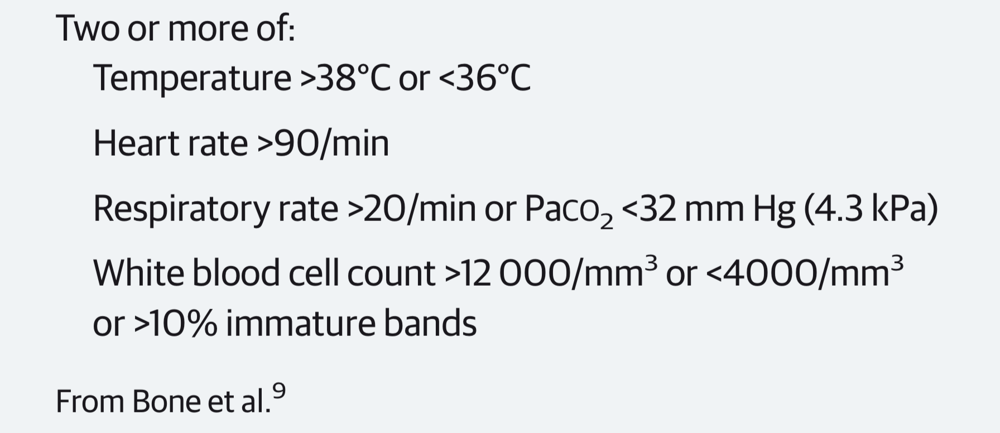
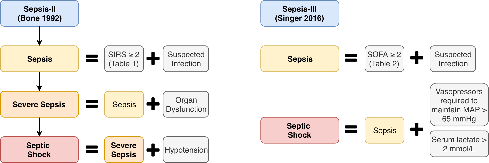

**Libraries Used:**
```{r message=F, warning=F}
# Data I/O
library('RPostgreSQL')    # access MIMIC-III
library('reshape2')       # melting dataframes
library('dplyr')          # misc. organization
library('data.table')     

# Data preparation
library('psych')          # descriptive stats

# Plots and tables
library('knitr')          # knitting Rmd to HTML; kable() function
library('kableExtra')     # extra formating options for knitr tables
library('ggplot2')        # 2d plotting
library('ggpubr')         # extra formatting options for ggplot
```

**Random Seed Set**
```{r message=F, warning=F}
set.seed(123456)
```

# Introduction

## Purpose

This tutorial is designed for students in the Multidisciplinary Design Program (MDP) from the University of Michigan College of Engineering. It is constructed in two main parts: data extraction and manipulation, and some exploratory analysis and visualization. Both sections are designed to simply illustrate use of the dataset in R, however, more tutorials in R, Python, and SQL are available in the <a href=https://github.com/MIT-LCP/mimic-code/tree/master/tutorials>tutorials</a> section of the <a href=https://github.com/MIT-LCP/mimic-code>MIT-LCP `mimic-code` repository</a>. Note that sections of this tutorial are taken from a previous HS650/DSPA assignment, which can be found <a href=http://bccummings.com/sample_projects/hs650_final_project.html>here</a>.

## Background

Modern sepsis is widely defined as a "dysregulated host response to infection" <a href=https://www.ncbi.nlm.nih.gov/pubmed/26903338>(Singer et al., 2016)</a>. It is commonly cited as a "leading cause of death and long-term disability in developed countries," and recent international multicenter cohort studies have estimated the mortality rate of severe sepsis to range from 23% to as high as 49% <a href=https://www.ncbi.nlm.nih.gov/pubmed/30466493>(Abe et. al, 2018)</a>. Those who do survive often suffer long-term physical and cognitive impairments <a href=https://www.ncbi.nlm.nih.gov/pubmed/20978258>(Iwashyna, Ely, Smith & Langa, 2010)</a>. It is one of the four most costly conditions in the United States, and in 2011 accounted for 5.2% of total healthcare expenditures with a price tag of $20 billion <a href=http://www.ncbi.nlm.nih.gov/books/NBK169005/>(Torio & Andrews, 2013)</a>. And it is a growing issue: while estimates of sepsis prevalence can vary widely based on the criteria used, annual increases in severe sepsis are consistently estimated to be as high as 13% nationwide <a href=https://www.ncbi.nlm.nih.gov/pubmed/23442987>(Gaieski, Edwards, Kallan, & Carr, 2013)</a>.

The heterogeneity of sepsis makes it a difficult condition to define <a href=https://www.ncbi.nlm.nih.gov/pubmed/28752002>(Gül, Arslantaş, Cinel, & Kumar, 2017)</a>. Early definitions dating back to Hippocrates “claimed that sepsis (σήψις) was the process by which flesh rots, swamps generate foul airs, and wounds fester” <a href=https://doi.org/10.1056/NEJMra1208623>(Angus & van der Poll, 2013;</a> <a href=https://www.ncbi.nlm.nih.gov/pubmed/2019770>Majno, 1991)</a>. Later, work by Louis Pasteur and others led to the notion of “blood poisoning.” <a href=https://doi.org/10.1056/NEJMra1208623>(Angus & van der Poll, 2013)</a>. This notion of sepsis as a systemic infection in which pathogenic microbes invade the bloodstream lasted until a 1991 meeting of the Critical Care Medicine Consensus Conference <a href=https://www.ncbi.nlm.nih.gov/pubmed/1303622>(Bone et al., 1992)</a>. New more potent antibiotics lead to the discovery that much sepsis-associated pathology could occur in patients who had been completely cleared of infection. Because of this discovery, the focus shifted from the microorganism and onto the host response to infection, which the conference referred to as the “Systemic Inflammatory Response Syndrome” or SIRS (Table 1). 
***

```{r, echo=F, fig.align='center', out.width = "400px", fig.cap="<font size='0.75em'><i>**Table 1: SIRS Criteria**. From <a href=https://www.ncbi.nlm.nih.gov/pubmed/26903338>(Singer et al., 2016)</a>. In conjunction with a plausible source of infection, the systemic inflammatory response syndrome (SIRS) criteria formed the backbone of the sepsis definition until 2016.</i></font>"}

```

***

The 1991 consensus definition was revised by a task force in 2001 but left largely unchanged <a href=https://www.ncbi.nlm.nih.gov/pubmed/12682500>(Levy et al., 2003)</a>. This operational definition (Sepsis-II) was the paradigm used during the data collection period of the MIMIC-III data set, and as such is particularly relevant. The condition of sepsis was conceptualized as a three-tiered hierarchy where each tier represents an increased risk of mortality (Figure 1):

* Sepsis: patient meets the SIRS criteria and who had a plausible source of infection.  
* Severe sepsis: patient meets requirements for sepsis and has evidence of organ dysfunction.  
* Septic shock: patient meets requirement for severe sepsis and has “sepsis-induced hypotension persisting despite adequate fluid resuscitation” <a href=https://www.ncbi.nlm.nih.gov/pubmed/1303622>(Bone et al., 1992)</a>.

***

```{r, echo=F, fig.align='center', fig.cap="<font size='0.75em'><i>**Figure 1: Definitions Associated with Sepsis-II and Sepsis-III**. Adapted from (Bone et al., 1992) and (Singer et al., 2016).</i></font>"}

```

***

One criticism of the SIRS scoring system is that it is not particularily specific, that is, many patients who are decidedly not septic still meet the criteria. For this tutorial, we will extract a sample of patients from the MIMIC-III dataset and examine the differences between septic and non-septic patients. The first section will be devoted to extracting data from the MIMIC-III dataset, with the end result being a CSV file containing the patient identifier, some physiology data from early on in the patients stay, and whether or not the patient was diagnosed with sepsis. This CSV will be provided to students who complete the MIMIC-III data use agreement. The second section will illustrate some exploratory data analysis techniques in R.

***

# Data extraction and manipulation

## Load the database

The first step is loading the database connection using the `RPostgreSQL` package. This connection is in the variable `con`) using the functions `dbConnect()` and  `dbExcecute()`. This connection will be open until it is closed using the function `dbDisconnent()`. Note that the `invisible()` wrapper around the `dbExecute()` function serves only to silence the output.

```{r eval=T, message=F, warning=F}
con <- dbConnect(dbDriver('PostgreSQL'), 
                 dbname = 'mimic', 
                 host = '127.0.0.1', 
                 port = '5432', 
                 user = 'postgres', 
                 password = 'postgres')

invisible(dbExecute(con, paste("SET search_path TO ", 
                               schema = 'mimiciii', 
                               sep=" ")))
```

## Extract cohort

After opening the connection to the database, we can generate a list of patient ID included in the dataset. Note that events in MIMIC-III are identified by patient number and admission number, where one patient can have multiple admissions but each admission is associated with exactly one patient. For the purposes of this tutorial, we will deal primarily with the patient identifier. After generating a list of subjects, we can randomly sample 5000 of them.

```{r eval=T, message=F, warning=F}
subject_id_list <- dbGetQuery(con, "SELECT SUBJECT_ID
                                  FROM DIAGNOSES_ICD")

subject_id_list = unique(subject_id_list$subject_id)

cohort_list <- subject_id_list[sample(length(subject_id_list), 5000)]
```

After generating a list of subjects, we can extract the various diagnoses associated with them. Diagnoses are encoded in MIMIC-III by their <a href=http://www.icd9data.com/>ICD-9 code</a>. There is a table within the database which details these codes, stored under `D_ICD_DIAGNOSES`.

```{r eval=T, message=F, warning=F}
d_icd_diagnoses <- dbGetQuery(con, "SELECT *
                                    FROM D_ICD_DIAGNOSES")

kable(head(d_icd_diagnoses), caption="Sample of `D_ICD_DIAGNOSES` SQL table") %>%
  kable_styling(bootstrap_options='striped')
```

## Collect diagnoses associated with each patient

Next, we can obtain a dataframe containing the diagnosis information for each patient, stored in a long format (see the DSPA lecture <a href=http://www.socr.umich.edu/people/dinov/courses/DSPA_notes/01_Foundation.html>here</a>). Using an example on <a href=https://stackoverflow.com/questions/45488833/create-a-list-of-all-values-of-a-variable-grouped-by-another-variable-in-r>Stack Overflow</a>, I convert it to a n-by-2 data frame where the column `icd9_code` contains a list of codes.

```{r eval=T, message=F, warning=F}
diagnosis_icd <- dbGetQuery(con, sprintf("SELECT *
                                          FROM DIAGNOSES_ICD
                                          WHERE subject_id IN (%s)", 
                                          paste(as.character(cohort_list), collapse=", ")))

cohort_data <- diagnosis_icd %>% group_by(subject_id) %>% 
  summarize(icd9_code = paste(sort(unique(icd9_code)),collapse=", "))

kable(head(cohort_data), caption="Sample dataframe returned by the DIAGNOSES_ICD table.") %>%
  kable_styling(bootstrap_options='striped')
```

## Collect physiologic data

For each of the four SIRS parameters, we'll do our best to extract this data as close to the patient's admission as possible. To facilitate this, I'll first create an abstracted function, which can be used to extract various parameters later on. Because the dataset is somewhat large, I also set up a caching system.

Most of the physiologic data values are stored in either the `CHARTEVENTS` or `LABEVENTS` table. There, each lab test or vital sign is associated with an `itemid` value, which is specified under the `D_ITEMS` or `D_LAB_ITEMS`. Due to a switch in data systems halfway through the acquisition period, there are often many different codes for a single vital sign. I've sorted through and did the best I could, but this will have to be an active area of development.

```{r message=F, warning=F}
parse_data <- function(con, table, itemid, cohort_list, cache_fn, isCached, keepRange){
  
  # Check if data is cached, and if not make the request to the database
  if(isCached == F){
    var_data <- dbGetQuery(con, sprintf("SELECT SUBJECT_ID, HADM_ID, CHARTTIME, VALUENUM, VALUEUOM
                                         FROM %s
                                         WHERE SUBJECT_ID IN (%s)
                                         AND ITEMID IN (%s)",
                                         table,
                                         paste(as.character(cohort_list), collapse=", "),
                                         paste(as.character(itemid), collapse=", ")))
    save(var_data, file=cache_fn)
  }
  
  # If a cached version is available, use it!
  if(isCached == T){
    load(cache_fn)
  }
  
  # Remove NA and impossible values
  var_data <- na.omit(var_data)
  var_data <- var_data[(var_data$valuenum > keepRange[1]) & (var_data$valuenum < keepRange[2]),]
  
  # Get first reading
  var_sorted <- var_data[order(var_data$charttime, decreasing=F),]
  var_first <- var_sorted[match(unique(var_sorted$subject_id), var_sorted$subject_id),]
  
  return(var_first)
}
```

### Temperature

For temperature specifically, the results are stored as a mixture of Celsius and Fahrenheit. 

```{r eval=T, message=F, warning=F}
temperature <- parse_data(con, "CHARTEVENTS", c(676,677, 223761, 223762), cohort_list, './cache/temperature.RData', T, c(10, 130))

# Convert F --> C
temperature[temperature$valueuom == '?F', 'valuenum'] <- as.numeric((as.numeric(temperature[temperature$valueuom == '?F', 'valuenum']) - 32)*5/9)

# Remove values outside range after conversion
temperature <- temperature[(temperature$valuenum > 20) & (temperature$valuenum < 50),]

# Add to cohort_data object
cohort_data <- merge(cohort_data, temperature[,c('subject_id', 'valuenum')], by=c('subject_id'), all=T)

colnames(cohort_data) <- c(colnames(cohort_data)[1:(length(cohort_data)-1)], 'temperature')

kable(head(cohort_data), caption="Sample dataframe after adding temperature.") %>%
  kable_styling(bootstrap_options='striped')
```

Of note, temperatures were only found for `r sum(!is.na(cohort_data$temperature))` out of `r length(cohort_list)` patients.

### Heart Rate

```{r eval=T, message=F, warning=F}
# Load data
heartrate <- parse_data(con, "CHARTEVENTS", c(211, 220045), cohort_list, './cache/heartrate.RData', T, c(20, 400))

# Add to data object
cohort_data <- merge(cohort_data, heartrate[,c('subject_id', 'valuenum')], by=c('subject_id'), all=T)

colnames(cohort_data) <- c(colnames(cohort_data)[1:(length(cohort_data)-1)], 'heartrate')

kable(head(cohort_data), caption="Sample dataframe after adding heartrate.") %>%
  kable_styling(bootstrap_options='striped')
```

`r sum(!is.na(cohort_data$heartrate))` out of `r length(cohort_list)` patients had heart rates that were found.

### Respiratory Rate

```{r eval=T, message=F, warning=F}
# Load data
resprate <- parse_data(con, "CHARTEVENTS", c(618, 220210), cohort_list, './cache/resptrate.RData', T, c(0, 100))

# Add to data object
cohort_data <- merge(cohort_data, resprate[,c('subject_id', 'valuenum')], by=c('subject_id'), all=T)

colnames(cohort_data) <- c(colnames(cohort_data)[1:(length(cohort_data)-1)], 'resprate')

kable(head(cohort_data), caption="Sample dataframe after adding resprate.") %>%
  kable_styling(bootstrap_options='striped')
```

`r sum(!is.na(cohort_data$resprate))` out of `r length(cohort_list)` patients had respiratory rates that were found.

### Pressure of Arterial Carbon Dioxide (PaCO_2_)

```{r eval=T, message=F, warning=F}
# Load data
paco2 <- parse_data(con, "LABEVENTS", 50818, cohort_list, './cache/paco2.RData', T, c(1, 150))

# Add to data object
cohort_data <- merge(cohort_data, paco2[,c('subject_id', 'valuenum')], by=c('subject_id'), all=T)

colnames(cohort_data) <- c(colnames(cohort_data)[1:(length(cohort_data)-1)], 'paco2')

kable(head(cohort_data), caption="Sample dataframe after adding PaCO_2_.") %>%
  kable_styling(bootstrap_options='striped')
```

`r sum(!is.na(cohort_data$paco2))` out of `r length(cohort_list)` patients had PaCO_2_ values that were found.

### White Blood Cell Count

```{r eval=T, message=F, warning=F}
# Load data
wbc <- parse_data(con, "LABEVENTS", 51301, cohort_list, './cache/wbc.RData', T, c(1, 150))

# Add to data object
cohort_data <- merge(cohort_data, wbc[,c('subject_id', 'valuenum')], by=c('subject_id'), all=T)

colnames(cohort_data) <- c(colnames(cohort_data)[1:(length(cohort_data)-1)], 'wbc')

kable(head(cohort_data), caption="Sample dataframe after adding White Blood Cell Count.") %>%
  kable_styling(bootstrap_options='striped')
```

`r sum(!is.na(cohort_data$wbc))` out of `r length(cohort_list)` patients had WBC counts that were found.

Lastly, we'll write the output to CSV for part two, and disconnect from the database.

```{r eval=T, message=F, warning=F}
write.csv(cohort_data, file='sample_data.csv', row.names=F)

# Disconnect from database
rm(list=ls())
#invisible(dbDisconnect(con))
```


